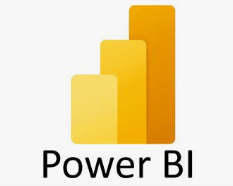

  <h1 align="center">Hi 👋, I'm Samar Saad</h1>
<h3 align="center">A Passionate Data Scientist and Backend Developer</h3>
  

  Hey there, I'm a CS grad exploring the exciting world of data science, and backend web development. 
 I love the challenge of solving problems with code and I'm always eager to learn and collaborate!

 

<h4>My Skills :</h4>

Programming Languages :  
  
  
   
     
         
             
                

 Frameworks and Libraries :   
                         
                           
                             
                              
                              
                               

                                
                         
                              

   Softwares and Databases :    
  
  
  
   

   </a>  <a href="https://pandas.pydata.org/" target="_blank" rel="noreferrer"> 
  
  

